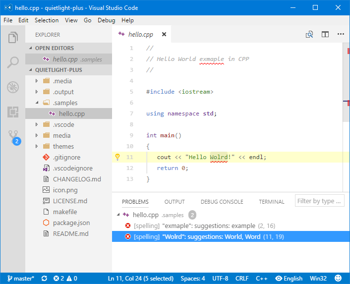

# Quiet Light+

Tuned for personal preferences Quiet Light Theme for Visual Studio Code.



## Installation

Search for *Quiet Light Plus* from the extension installer within VSCode or execute below line in the **command palette** (**F1**/**Ctrl+Shift+P**):
```
ext install quietlight-plus
```

# Issues

Please report all the errors and/or annoyances that you see on the [issues](https://github.com/bartosz-antosik/vscode-quietlight-plus/issues) page.